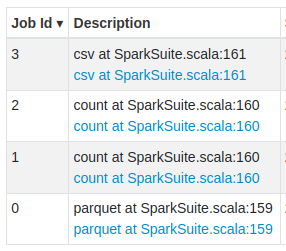
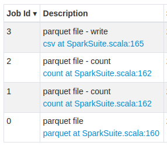

# Spark Extension

This project provides extensions to the [Apache Spark project](https://spark.apache.org/) in Scala and Python:

**[Diff](DIFF.md) [<sup>[*]</sup>](#spark-connect-server):** A `diff` transformation and application for `Dataset`s that computes the differences between
two datasets, i.e. which rows to _add_, _delete_ or _change_ to get from one dataset to the other.

**[SortedGroups](GROUPS.md):** A `groupByKey` transformation that groups rows by a key while providing
a **sorted** iterator for each group. Similar to `Dataset.groupByKey.flatMapGroups`, but with order guarantees
for the iterator.

**[Histogram](HISTOGRAM.md) [<sup>[*]</sup>](#spark-connect-server):** A `histogram` transformation that computes the histogram DataFrame for a value column.

**[Global Row Number](ROW_NUMBER.md) [<sup>[*]</sup>](#spark-connect-server):** A `withRowNumbers` transformation that provides the global row number w.r.t.
the current order of the Dataset, or any given order. In contrast to the existing SQL function `row_number`, which
requires a window spec, this transformation provides the row number across the entire Dataset without scaling problems.

**[Partitioned Writing](PARTITIONING.md):** The `writePartitionedBy` action writes your `Dataset` partitioned and
efficiently laid out with a single operation.

**[Inspect Parquet files](PARQUET.md) [<sup>[*]</sup>](#spark-connect-server):** The structure of Parquet files (the metadata, not the data stored in Parquet) can be inspected similar to [parquet-tools](https://pypi.org/project/parquet-tools/)
or [parquet-cli](https://pypi.org/project/parquet-cli/) by reading from a simple Spark data source.
This simplifies identifying why some Parquet files cannot be split by Spark into scalable partitions.

**[Install Python packages into PySpark job](PYSPARK-DEPS.md) [<sup>[*]</sup>](#spark-connect-server):** Install Python dependencies via PIP or Poetry programatically into your running PySpark job (PySpark ≥ 3.1.0):

```python
# noinspection PyUnresolvedReferences
from gresearch.spark import *

# using PIP
spark.install_pip_package("pandas==1.4.3", "pyarrow")
spark.install_pip_package("-r", "requirements.txt")

# using Poetry
spark.install_poetry_project("../my-poetry-project/", poetry_python="../venv-poetry/bin/python")
```

**[Fluent method call](CONDITIONAL.md):** `T.call(transformation: T => R): R`: Turns a transformation `T => R`,
that is not part of `T` into a fluent method call on `T`. This allows writing fluent code like:

```scala
import uk.co.gresearch._

i.doThis()
 .doThat()
 .call(transformation)
 .doMore()
```

**[Fluent conditional method call](CONDITIONAL.md):** `T.when(condition: Boolean).call(transformation: T => T): T`:
Perform a transformation fluently only if the given condition is true.
This allows writing fluent code like:

```scala
import uk.co.gresearch._

i.doThis()
 .doThat()
 .when(condition).call(transformation)
 .doMore()
```

**[Shortcut for groupBy.as](https://github.com/G-Research/spark-extension/pull/213#issue-2032837105)**: Calling `Dataset.groupBy(Column*).as[K, T]`
should be preferred over calling `Dataset.groupByKey(V => K)` whenever possible. The former allows Catalyst to exploit
existing partitioning and ordering of the Dataset, while the latter hides from Catalyst which columns are used to create the keys.
This can have a significant performance penalty.

<details>
<summary>Details:</summary>

The new column-expression-based `groupByKey[K](Column*)` method makes it easier to group by a column expression key. Instead of

    ds.groupBy($"id").as[Int, V]

use:

    ds.groupByKey[Int]($"id")
</details>

**Backticks:** `backticks(string: String, strings: String*): String)`: Encloses the given column name with backticks (`` ` ``) when needed.
This is a handy way to ensure column names with special characters like dots (`.`) work with `col()` or `select()`.

**Count null values:** `count_null(e: Column)`: an aggregation function like `count` that counts null values in column `e`.
This is equivalent to calling `count(when(e.isNull, lit(1)))`.

**.Net DateTime.Ticks[<sup>[*]</sup>](#spark-connect-server):** Convert .Net (C#, F#, Visual Basic) `DateTime.Ticks` into Spark timestamps, seconds and nanoseconds.

<details>
<summary>Available methods:</summary>

```scala
// Scala
dotNetTicksToTimestamp(Column): Column       // returns timestamp as TimestampType
dotNetTicksToUnixEpoch(Column): Column       // returns Unix epoch seconds as DecimalType
dotNetTicksToUnixEpochNanos(Column): Column  // returns Unix epoch nanoseconds as LongType
```

The reverse is provided by (all return `LongType` .Net ticks):
```scala
// Scala
timestampToDotNetTicks(Column): Column
unixEpochToDotNetTicks(Column): Column
unixEpochNanosToDotNetTicks(Column): Column
```

These methods are also available in Python:
```python
# Python
dotnet_ticks_to_timestamp(column_or_name)         # returns timestamp as TimestampType
dotnet_ticks_to_unix_epoch(column_or_name)        # returns Unix epoch seconds as DecimalType
dotnet_ticks_to_unix_epoch_nanos(column_or_name)  # returns Unix epoch nanoseconds as LongType

timestamp_to_dotnet_ticks(column_or_name)
unix_epoch_to_dotnet_ticks(column_or_name)
unix_epoch_nanos_to_dotnet_ticks(column_or_name)
```
</details>

**Spark temporary directory[<sup>[*]</sup>](#spark-connect-server)**: Create a temporary directory that will be removed on Spark application shutdown.

<details>
<summary>Examples:</summary>

Scala:
```scala
import uk.co.gresearch.spark.createTemporaryDir

val dir = createTemporaryDir("prefix")
```

Python:
```python
# noinspection PyUnresolvedReferences
from gresearch.spark import *

dir = spark.create_temporary_dir("prefix")
```
</details>

**Spark job description[<sup>[*]</sup>](#spark-connect-server):** Set Spark job description for all Spark jobs within a context.

<details>
<summary>Examples:</summary>

```scala
import uk.co.gresearch.spark._

implicit val session: SparkSession = spark

withJobDescription("parquet file") {
  val df = spark.read.parquet("data.parquet")
  val count = appendJobDescription("count") {
    df.count
  }
  appendJobDescription("write") {
    df.write.csv("data.csv")
  }
}
```

| Without job description  | With job description |
|:---:|:---:|
|  |  |

Note that setting a description in one thread while calling the action (e.g. `.count`) in a different thread
does not work, unless the different thread is spawned from the current thread _after_ the description has been set.

Working example with parallel collections:

```scala
import java.util.concurrent.ForkJoinPool
import scala.collection.parallel.CollectionConverters.seqIsParallelizable
import scala.collection.parallel.ForkJoinTaskSupport

val files = Seq("data1.csv", "data2.csv").par

val counts = withJobDescription("Counting rows") {
  // new thread pool required to spawn new threads from this thread
  // so that the job description is actually used
  files.tasksupport = new ForkJoinTaskSupport(new ForkJoinPool())
  files.map(filename => spark.read.csv(filename).count).sum
}(spark)
```
</details>

## Using Spark Extension

The `spark-extension` package is available for all Spark 3.2, 3.3, 3.4 and 3.5 versions. Some earlier Spark versions may also be supported.
The package version has the following semantics: `spark-extension_{SCALA_COMPAT_VERSION}-{VERSION}-{SPARK_COMPAT_VERSION}`:

- `SCALA_COMPAT_VERSION`: Scala binary compatibility (minor) version. Available are `2.12` and `2.13`.
- `SPARK_COMPAT_VERSION`: Apache Spark binary compatibility (minor) version. Available are `3.2`, `3.3`, `3.4` and `3.5`.
- `VERSION`: The package version, e.g. `2.10.0`.

### SBT

Add this line to your `build.sbt` file:

```sbt
libraryDependencies += "uk.co.gresearch.spark" %% "spark-extension" % "2.12.0-3.5"
```

### Maven

Add this dependency to your `pom.xml` file:

```xml
<dependency>
  <groupId>uk.co.gresearch.spark</groupId>
  <artifactId>spark-extension_2.12</artifactId>
  <version>2.12.0-3.5</version>
</dependency>
```

### Gradle

Add this dependency to your `build.gradle` file:

```groovy
dependencies {
    implementation "uk.co.gresearch.spark:spark-extension_2.12:2.12.0-3.5"
}
```

### Spark Submit

Submit your Spark app with the Spark Extension dependency (version ≥1.1.0) as follows:

```shell script
spark-submit --packages uk.co.gresearch.spark:spark-extension_2.12:2.12.0-3.5 [jar]
```

Note: Pick the right Scala version (here 2.12) and Spark version (here 3.5) depending on your Spark version.

### Spark Shell

Launch a Spark Shell with the Spark Extension dependency (version ≥1.1.0) as follows:

```shell script
spark-shell --packages uk.co.gresearch.spark:spark-extension_2.12:2.12.0-3.5
```

Note: Pick the right Scala version (here 2.12) and Spark version (here 3.5) depending on your Spark Shell version.

### Python

#### PySpark API

Start a PySpark session with the Spark Extension dependency (version ≥1.1.0) as follows:

```python
from pyspark.sql import SparkSession

spark = SparkSession \
    .builder \
    .config("spark.jars.packages", "uk.co.gresearch.spark:spark-extension_2.12:2.12.0-3.5") \
    .getOrCreate()
```

Note: Pick the right Scala version (here 2.12) and Spark version (here 3.5) depending on your PySpark version.

#### PySpark REPL

Launch the Python Spark REPL with the Spark Extension dependency (version ≥1.1.0) as follows:

```shell script
pyspark --packages uk.co.gresearch.spark:spark-extension_2.12:2.12.0-3.5
```

Note: Pick the right Scala version (here 2.12) and Spark version (here 3.5) depending on your PySpark version.

#### PySpark `spark-submit`

Run your Python scripts that use PySpark via `spark-submit`:

```shell script
spark-submit --packages uk.co.gresearch.spark:spark-extension_2.12:2.12.0-3.5 [script.py]
```

Note: Pick the right Scala version (here 2.12) and Spark version (here 3.5) depending on your Spark version.

#### PyPi package (local Spark cluster only)

You may want to install the `pyspark-extension` python package from PyPi into your development environment.
This provides you code completion, typing and test capabilities during your development phase.

Running your Python application on a Spark cluster will still require one of the above ways
to add the Scala package to the Spark environment.

```shell script
pip install pyspark-extension==2.12.0.3.5
```

Note: Pick the right Spark version (here 3.5) depending on your PySpark version.

### Your favorite Data Science notebook

There are plenty of [Data Science notebooks](https://datasciencenotebook.org/) around. To use this library,
add **a jar dependency** to your notebook using these **Maven coordinates**:

    uk.co.gresearch.spark:spark-extension_2.12:2.12.0-3.5

Or [download the jar](https://mvnrepository.com/artifact/uk.co.gresearch.spark/spark-extension) and place it
on a filesystem where it is accessible by the notebook, and reference that jar file directly.

Check the documentation of your favorite notebook to learn how to add jars to your Spark environment.

## Known issues
### Spark Connect Server

Most features are not supported **in Python** in conjunction with a [Spark Connect server](https://spark.apache.org/docs/latest/spark-connect-overview.html).
This also holds for Databricks Runtime environment 13.x and above. Details can be found [in this blog](https://semyonsinchenko.github.io/ssinchenko/post/how-databricks-14x-breaks-3dparty-compatibility/).

Calling any of those features when connected to a Spark Connect server will raise this error:

    This feature is not supported for Spark Connect.

Use a classic connection to a Spark cluster instead.

## Build

You can build this project against different versions of Spark and Scala.

### Switch Spark and Scala version

If you want to build for a Spark or Scala version different to what is defined in the `pom.xml` file, then run

```shell script
sh set-version.sh [SPARK-VERSION] [SCALA-VERSION]
```

For example, switch to Spark 3.5.0 and Scala 2.13.8 by running `sh set-version.sh 3.5.0 2.13.8`.

### Build the Scala project

Then execute `mvn package` to create a jar from the sources. It can be found in `target/`.

## Testing

Run the Scala tests via `mvn test`.

### Setup Python environment

In order to run the Python tests, setup a Python environment as follows (replace `[SCALA-COMPAT-VERSION]` and `[SPARK-COMPAT-VERSION]` with the respective values):

```shell script
virtualenv -p python3 venv
source venv/bin/activate
pip install -r python/requirements-[SPARK-COMPAT-VERSION]_[SCALA-COMPAT-VERSION].txt
pip install pytest
```

### Run Python tests

Run the Python tests via `env PYTHONPATH=python:python/test python -m pytest python/test`.

Note: you first have to [build the Scala sources](#build-the-scala-project).

### Build Python package

Run the following sequence of commands in the project root directory:

```shell script
mkdir -p python/pyspark/jars/
cp -v target/spark-extension_*-*.jar python/pyspark/jars/
pip install build
```

Then execute `python -m build python/` to create a whl from the sources. It can be found in `python/dist/`.

## Publications

- ***Guaranteeing in-partition order for partitioned-writing in Apache Spark**, Enrico Minack, 20/01/2023*:<br/>https://www.gresearch.com/blog/article/guaranteeing-in-partition-order-for-partitioned-writing-in-apache-spark/
- ***Un-pivot, sorted groups and many bug fixes: Celebrating the first Spark 3.4 release**, Enrico Minack, 21/03/2023*:<br/>https://www.gresearch.com/blog/article/un-pivot-sorted-groups-and-many-bug-fixes-celebrating-the-first-spark-3-4-release/
- ***A PySpark bug makes co-grouping with window function partition-key-order-sensitive**, Enrico Minack, 29/03/2023*:<br/>https://www.gresearch.com/blog/article/a-pyspark-bug-makes-co-grouping-with-window-function-partition-key-order-sensitive/
- ***Spark’s groupByKey should be avoided – and here’s why**, Enrico Minack, 13/06/2023*:<br/>https://www.gresearch.com/blog/article/sparks-groupbykey-should-be-avoided-and-heres-why/
- ***Inspecting Parquet files with Spark**, Enrico Minack, 28/07/2023*:<br/>https://www.gresearch.com/blog/article/parquet-files-know-your-scaling-limits/
- ***Enhancing Spark’s UI with Job Descriptions**, Enrico Minack, 12/12/2023*:<br/>https://www.gresearch.com/blog/article/enhancing-sparks-ui-with-job-descriptions/
